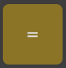
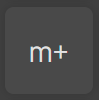

<h1 align="center">Innowise calculator</h1>
<h5 align="center">Only for sky calculations</h5>

<div align="center" style="display: flex; justify-content: space-between">
  <div width="50%">
    <h3>Dark Mode</h3>
    
  </div>
  <div width="50%">
    <h3>Light Mode</h3>
    
  </div>
</div>

<h1 align="center">Task</h1>

<a href="https://docs.google.com/document/d/1EBK8fXs3INFV7GJwYhnF4et83VpBeh4dy-5ZhMDob1U/edit#" style="display: flex; justify-content: center">Link on task</a>

<h1 align="center">How to use</h1>

<div style="margin-left: 50px; display: grid; grid-template-columns: repeat(4, 1fr);">
  <!-- Theme changer -->
  <div style="display: flex; flex-direction: column; justify-content: center; align-items: center; margin-bottom: 10px;">
    
    <p style="flex-basis: 70%;">Theme changer</p>
  </div>
  <!-- numbers -->
  <div style="display: flex; flex-direction: column; justify-content: center; align-items: center; margin-bottom: 10px;">
    
    <p align="center" style="flex-basis: 70%;">Buttons for input numbers</p>
  </div>
  <!-- Devision -->
  <div style="display: flex; flex-direction: column; justify-content: center; align-items: center; margin-bottom: 10px;">
    
    <p style="flex-basis: 70%;">Devision button</p>
  </div>
  <!-- mult -->
  <div style="display: flex; flex-direction: column; justify-content: center; align-items: center; margin-bottom: 10px;">
    
    <p style="flex-basis: 70%;">Multiply button</p>
  </div>
  <!-- minus -->
  <div style="display: flex; flex-direction: column; justify-content: center; align-items: center; margin-bottom: 10px;">
    
    <p style="flex-basis: 70%;">Minus button</p>
  </div>
  <!-- plus -->
  <div style="display: flex; flex-direction: column; justify-content: center; align-items: center; margin-bottom: 10px;">
    
    <p style="flex-basis: 70%;">Plus button</p>
  </div>
  <!-- equal -->
  <div style="display: flex; flex-direction: column; justify-content: center; align-items: center; margin-bottom: 10px;">
    
    <p align="center" style="flex-basis: 70%;">Equal button, repeat last operation</p>
  </div>
  <!-- reset -->
  <div style="display: flex; flex-direction: column; justify-content: center; align-items: center; margin-bottom: 10px;">
    
    <p style="flex-basis: 70%;">Reset button</p>
  </div>
  <!-- plus-minus -->
  <div style="display: flex; flex-direction: column; justify-content: center; align-items: center; margin-bottom: 10px;">
    
    <p style="flex-basis: 70%;">Plus/minus button</p>
  </div>
  <!-- percent -->
  <div style="display: flex; flex-direction: column; justify-content: center; align-items: center; margin-bottom: 10px;">
    
    <p align="center" style="flex-basis: 70%;">Devision second number by 100</p>
  </div>
  <!-- mc -->
  <div style="display: flex; flex-direction: column; justify-content: center; align-items: center; margin-bottom: 10px;">
    
    <p style="flex-basis: 70%;">Memory clear</p>
  </div>
  <!-- m-plus -->
  <div style="display: flex; flex-direction: column; justify-content: center; align-items: center; margin-bottom: 10px;">
    
    <p style="flex-basis: 70%;">Add to memory</p>
  </div>
  <!-- m-minus -->
  <div style="display: flex; flex-direction: column; justify-content: center; align-items: center; margin-bottom: 10px;">
    
    <p align="center" style="flex-basis: 70%;">Subtract from the memory</p>
  </div>
  <!-- mr -->
  <div style="display: flex; flex-direction: column; justify-content: center; align-items: center; margin-bottom: 10px;">
    
    <p align="center" style="flex-basis: 70%;">Write memory number</p>
  </div>
  <!-- x-square -->
  <div style="display: flex; flex-direction: column; justify-content: center; align-items: center; margin-bottom: 10px;">
    
    <p style="flex-basis: 70%;">Square</p>
  </div>
  <!-- x-cube -->
  <div style="display: flex; flex-direction: column; justify-content: center; align-items: center; margin-bottom: 10px;">
    
    <p style="flex-basis: 70%;">Cube</p>
  </div>
  <!-- x-in-y -->
  <div style="display: flex; flex-direction: column; justify-content: center; align-items: center; margin-bottom: 10px;">
    
    <p style="flex-basis: 70%;">Power</p>
  </div>
  <!-- e-in-x -->
  <div style="display: flex; flex-direction: column; justify-content: center; align-items: center; margin-bottom: 10px;">
    
    <p style="flex-basis: 70%;">e power</p>
  </div>
  <!-- ten-in-x -->
  <div style="display: flex; flex-direction: column; justify-content: center; align-items: center; margin-bottom: 10px;">
    
    <p style="flex-basis: 70%;">ten power</p>
  </div>
  <!-- 1-dev-x -->
  <div style="display: flex; flex-direction: column; justify-content: center; align-items: center; margin-bottom: 10px;">
    
    <p style="flex-basis: 70%;">Devide 1</p>
  </div>
  <!-- square-root -->
  <div style="display: flex; flex-direction: column; justify-content: center; align-items: center; margin-bottom: 10px;">
    
    <p style="flex-basis: 70%;">Square root</p>
  </div>
  <!-- cube-root -->
  <div style="display: flex; flex-direction: column; justify-content: center; align-items: center; margin-bottom: 10px;">
    
    <p style="flex-basis: 70%;">Cube root</p>
  </div>
  <!-- y-root -->
  <div style="display: flex; flex-direction: column; justify-content: center; align-items: center; margin-bottom: 10px;">
    
    <p style="flex-basis: 70%;">Root</p>
  </div>
  <!-- x-fact -->
  <div style="display: flex; flex-direction: column; justify-content: center; align-items: center; margin-bottom: 10px;">
    
    <p style="flex-basis: 70%;">Factorial</p>
  </div>
  <!-- back -->
  <div style="display: flex; flex-direction: column; justify-content: center; align-items: center; margin-bottom: 10px;">
    
    <p style="flex-basis: 70%;">Previous operation</p>
  </div>
</div>

<h1 align="center">How to run</h1>

<a href="https://skywebtehnol.ru/innowise-calc/SPR/" style="display: flex; justify-content: center">Live Demo</a>

```
    npm install
    npm run dev / npm run build
```

<h1 align="center">Structure</h1>

- Root folder
  - .husky / folder for husky settings(pre-commit hook)
  - coverage / folder for jest testing data
  - readme_assets / assets for README.md file
  - src / main project files
    - modules / project modules
      - Commands / calculator commands
